# SOC 合规自动化软件 — 业务流程图

## 1. 系统全景

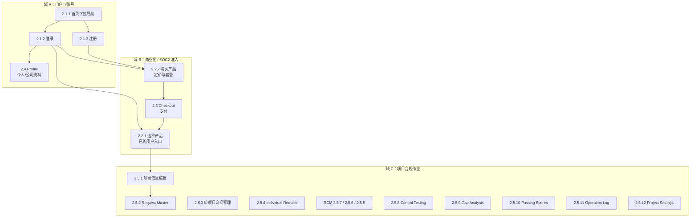

## 2. 新用户 / 未购用户

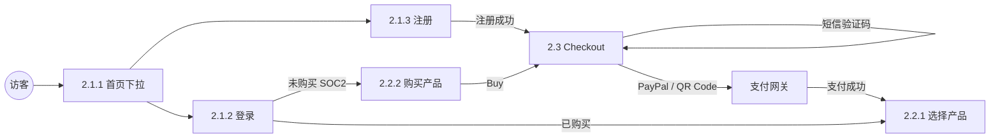

## 3. 已购用户

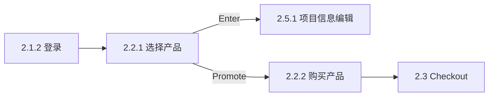

## 4. Profile

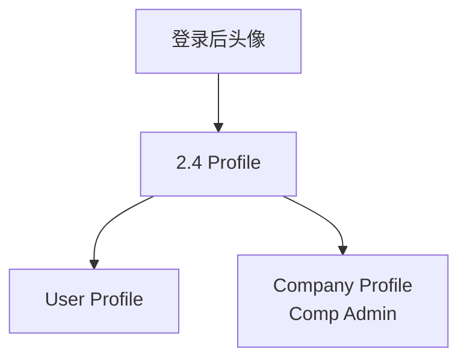

## 5. SOC2 与项目主线

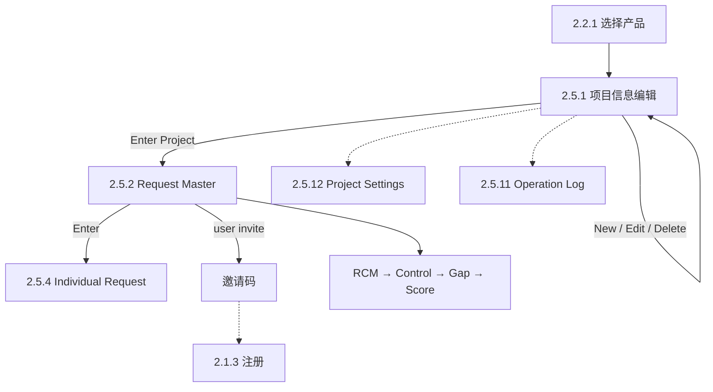

## 6. 合规核心流水线

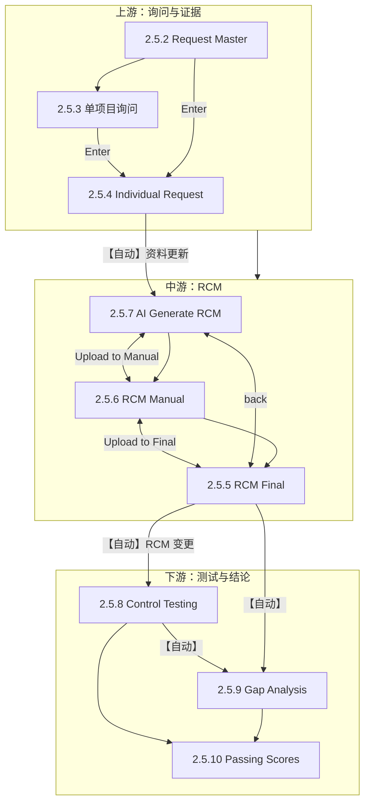

## 7. Individual Request → RCM 时序

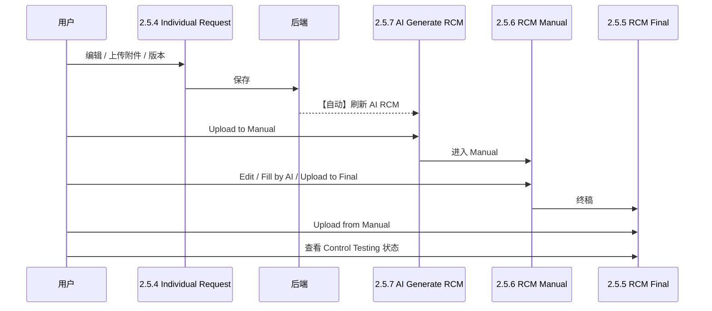

## 8. RCM 三阶段

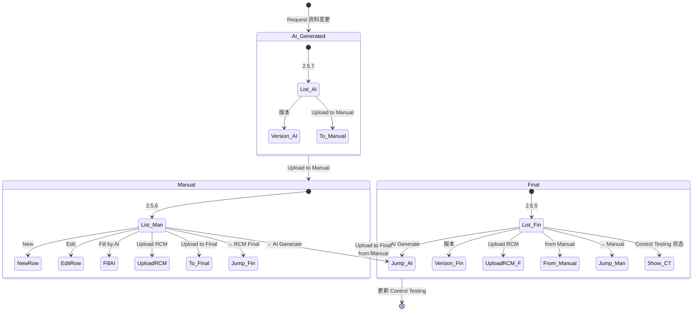

## 9. 数据级联

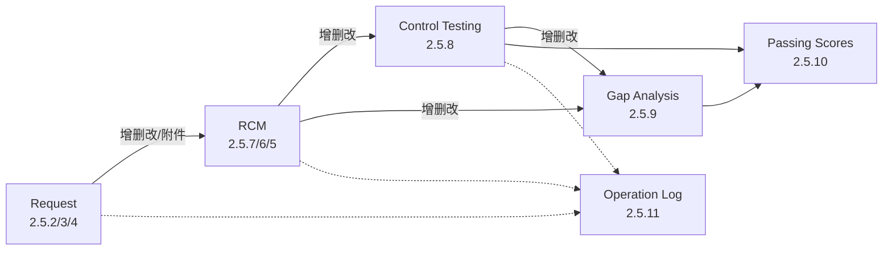

## 10. 页面跳转总图

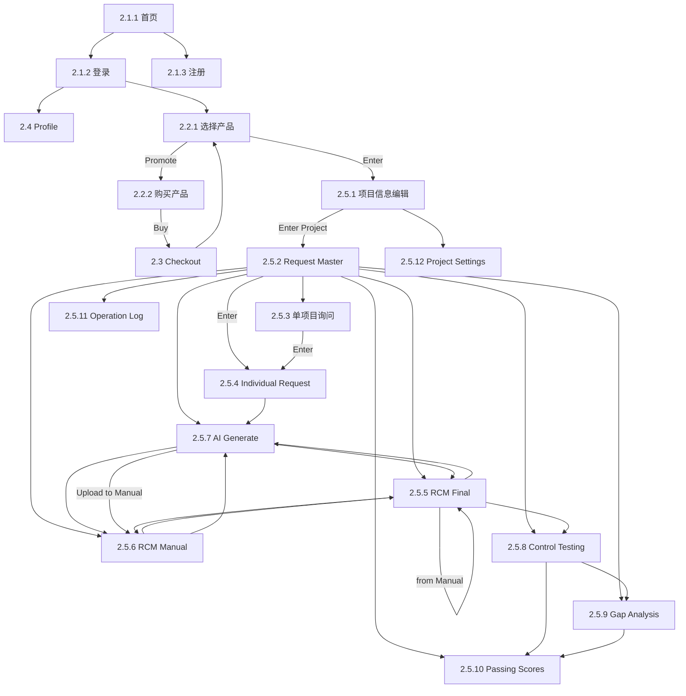

## 11. 角色与横切

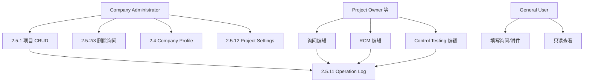

## 12. 端到端作业顺序

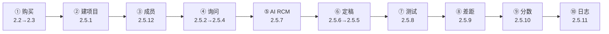
